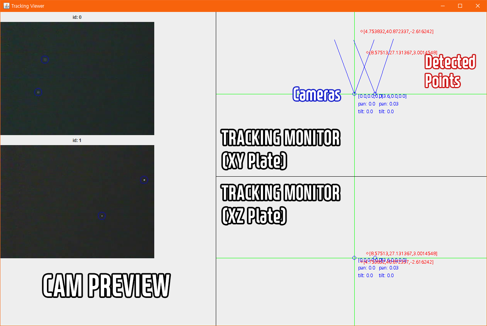

# IR Object Tracking

IR Object Tracking은 '흙수저 VR 프로젝트'의 일부로 사물의 위치와 방향을 추적합니다.

두 개 이상의 적외선 카메라(트래커)를 사용해 사물의 표면에 부착된 IR LED를 감지하고, 이를 통해 사물을 추적합니다.

IR Object Tracking tracks objects and gives you its position and direction.

It is a part of my 'Cheap VR under $200' project.

2 or more IR cameras detect IR LEDs on the object to track it.

## Screenshots

## Requires
- OpenCV v3.4.6

## Default tracker setting

- 0: \[13.6, 0, 0\], 172.30.1.91
- 1: \[0,    0, 0\], 172.30.1.92

## Parts
- ESP32-CAM (OV2640)
- IR Filter
- IR LED (SFH485P)

## Credit
- IR Object Tracking: Apache License 2.0 Copyright 2019 - 2020, Wei756([@wei756](http://github.com/wei756)) (kjhoon1122@naver.com)
- [Httpd](./esp32-cam/CameraWebServer/app_httpd.cpp): Apache License 2.0 Copyright 2015 - 2016, Espressif Systems (Shanghai) PTE LTD
- [MJpegRunner](http://thistleshrub.net/www/index.php?controller=posts&action=show&id=2012-05-13DisplayingStreamedMJPEGinJava.txt): Copyright 2012, shrub34